<picture>
  <source media="(prefers-color-scheme: dark)" srcset="https://capsule-render.vercel.app/api?type=venom&height=200&color=gradient&customColorList=2%2C2%2C5%2C9%2C15&text=Anmol%20Jaiswal&fontSize=55&animation=fadeIn&fontAlignY=35&desc=Applied%20AI%20Engineer&descSize=20&descAlignY=55&fontColor=fff">
  <source media="(prefers-color-scheme: light)" srcset="https://capsule-render.vercel.app/api?type=venom&height=200&color=gradient&customColorList=2%2C2%2C5%2C9%2C15&text=Anmol%20Jaiswal&fontSize=55&animation=fadeIn&fontAlignY=35&desc=Applied%20AI%20Engineer&descSize=20&descAlignY=55&fontColor=1f2328">
  
</picture>

<p align="center">
  <a href="https://github.com/anmolg1997"></a>
</p>

<p align="center">
  <a href="https://www.linkedin.com/in/anmol-8756772501/"></a>
  &nbsp;
  <a href="mailto:the.anmol.jaiswal@gmail.com"></a>
  &nbsp;
  <a href="https://pypi.org/project/adk-database-memory/"></a>
  &nbsp;
  <a href="https://pypi.org/project/adk-database-memory/"></a>
  &nbsp;
  <a href="https://github.com/anmolg1997?tab=followers"></a>
</p>

<p align="center">
  Contributor to <a href="https://github.com/google/adk-python/pulls?q=is%3Apr+author%3Aanmolg1997">Google ADK</a> · <a href="https://github.com/pydantic/pydantic-ai/pulls?q=is%3Apr+author%3Aanmolg1997">Pydantic AI</a> · <a href="https://github.com/BerriAI/litellm/pulls?q=is%3Apr+author%3Aanmolg1997">LiteLLM</a> · <a href="https://github.com/ggml-org/llama.cpp/pull/21931">llama.cpp</a> · <a href="https://github.com/ag-ui-protocol/ag-ui/pulls?q=is%3Apr+author%3Aanmolg1997">ag-ui</a>
  <br/>
  <sub>7+ years in applied AI &nbsp;·&nbsp; author of a package in the official ADK integrations catalog</sub>
</p>

<picture>
  <source media="(prefers-color-scheme: dark)" srcset="assets/divider-dark.svg">
  <source media="(prefers-color-scheme: light)" srcset="assets/divider-light.svg">
  
</picture>

## About

I build **production AI systems** that reason, plan, and execute autonomously — from multi-agent orchestration to enterprise RAG pipelines, LoRA fine-tuning at scale, and multi-adapter inference serving.

| Focus area | Working with |
|:-----------|:-------------|
| **Multi-agent AI** | `Google ADK` `A2A Protocol` `MCP` `Agent Orchestration` |
| **Knowledge graphs & RAG** | `Neo4j GraphRAG` `Hybrid Search` `Reranking` `Guardrails` |
| **LLM fine-tuning & serving** | `LoRA / QLoRA` `Unsloth` `vLLM` `Multi-Adapter Inference` |
| **LLM observability** | `Langfuse` `MLflow` `OpenSearch` `Domain Evaluation` |
| **Model building** | `Transformers from scratch` `DeepSpeed` `SFT / DPO / RLHF` |

### Now building

| Project | What it is |
|:--------|:-----------|
| [rhytm](https://github.com/anmolg1997/rhytm) | Multi-agent framework for proprietary data analysis with business intelligence |
| [fincept-operator-skill](https://github.com/anmolg1997/fincept-operator-skill) | Claude Code agent skill that operates and monitors a trading terminal, with hard safety rails (paper-only, human-approved live actions) |
| [SLM-From-Scratch](https://github.com/anmolg1997/SLM-From-Scratch) | Ongoing: alignment utilities and GGUF / ONNX export paths for small language models |

<picture>
  <source media="(prefers-color-scheme: dark)" srcset="assets/divider-dark.svg">
  <source media="(prefers-color-scheme: light)" srcset="assets/divider-light.svg">
  
</picture>

## Open source

<table>
<tr>
<td width="33%" valign="top">
<h3><a href="https://github.com/google/adk-python">Google ADK Python</a></h3>
<p>Designed the first Firestore session service: transactional state, subcollection events, batch deletes. Design patterns adopted in the <a href="https://github.com/google/adk-python/pull/5088">official implementation</a>, with the work <a href="https://github.com/google/adk-python/pull/5088#issue-3117591856">credited</a> by a Google engineer.</p>
<p><a href="https://github.com/google/adk-python/pulls?q=is%3Apr+author%3Aanmolg1997"></a></p>
</td>
<td width="33%" valign="top">
<h3><a href="https://github.com/google/adk-python-community">ADK Community</a></h3>
<p>Contributed <code>FirestoreSessionService</code> with 19 unit tests, in-memory mocks, and production-grade design: race-safe transactions, N+1 query elimination, async batch deletes.</p>
<p><a href="https://github.com/google/adk-python-community/pull/104"></a></p>
</td>
<td width="33%" valign="top">
<h3><a href="https://github.com/ag-ui-protocol/ag-ui">ag-ui Protocol</a></h3>
<p>Major ADK middleware upgrade for <code>google-adk 2.0</code> (+975/−48 LOC, closed <a href="https://github.com/ag-ui-protocol/ag-ui/pull/1746">2 upstream issues</a>), plus LangGraph adapter fixes: trailing-slash route, fork config passthrough, regenerated stream message IDs.</p>
<p><a href="https://github.com/ag-ui-protocol/ag-ui/pulls?q=is%3Apr+author%3Aanmolg1997"></a></p>
</td>
</tr>
<tr>
<td width="33%" valign="top">
<h3><a href="https://github.com/pydantic/pydantic-ai">Pydantic AI</a></h3>
<p>Merged fix for LLM-as-judge evals: constrain the reason field so reasoning models stay concise and retry-safe (<a href="https://github.com/pydantic/pydantic-ai/pull/5089">#5089</a>). Plus a built-in history processor repairing orphaned tool calls that cause provider 400 errors.</p>
<p><a href="https://github.com/pydantic/pydantic-ai/pulls?q=is%3Apr+author%3Aanmolg1997"></a></p>
</td>
<td width="33%" valign="top">
<h3><a href="https://github.com/ggml-org/llama.cpp">llama.cpp</a></h3>
<p>Added type and integer-range validation to <code>GGUFWriter.add_key_value</code>: catches type mismatches and integer overflow before they silently corrupt model metadata.</p>
<p><a href="https://github.com/ggml-org/llama.cpp/pull/21931"></a></p>
</td>
<td width="33%" valign="top">
<h3><a href="https://github.com/BerriAI/litellm">LiteLLM</a></h3>
<p>Merged fix for a KeyError crash in Anthropic file-id discovery on non-OpenAI file content blocks (<a href="https://github.com/BerriAI/litellm/pull/26228">#26228</a>). Follow-up disposes recycled aiohttp sessions deterministically, fixing unclosed-session leaks (<a href="https://github.com/BerriAI/litellm/pull/32003">#32003</a>).</p>
<p><a href="https://github.com/BerriAI/litellm/pulls?q=is%3Apr+author%3Aanmolg1997"></a></p>
</td>
</tr>
<tr>
<td width="33%" valign="top">
<h3><a href="https://github.com/anmolg1997/adk-database-memory">adk-database-memory</a></h3>
<p>SQL-backed persistent memory service for the Google ADK. Async SQLAlchemy, Postgres / MySQL / SQLite, drop-in for <code>InMemoryMemoryService</code>. Listed in the <a href="https://google.github.io/adk-docs/integrations/database-memory/">official ADK integrations catalog</a>.</p>
<p><a href="https://pypi.org/project/adk-database-memory/"></a></p>
</td>
<td width="33%" valign="top">
<h3><a href="https://github.com/anmolg1997/prepostmortem-skills">(pre·post)mortem</a></h3>
<p>Pre-mortems and postmortems for AI coding agents: 261 tagged real-world incidents and a 12-class agentic-AI failure model, shipped as agent skills for risk review before and after changes.</p>
<p><a href="https://github.com/anmolg1997/prepostmortem-skills"></a></p>
</td>
<td width="33%" valign="top"></td>
</tr>
</table>

<picture>
  <source media="(prefers-color-scheme: dark)" srcset="assets/divider-dark.svg">
  <source media="(prefers-color-scheme: light)" srcset="assets/divider-light.svg">
  
</picture>

## Featured work

<table>
<tr>
<td width="50%" valign="top">
<h3><a href="https://github.com/anmolg1997/SLM-From-Scratch">SLM From Scratch</a></h3>
<p>Build language models from zero: BPE tokenizer, composable Transformer (RoPE, GQA, SwiGLU), DeepSpeed training, SFT / DPO / RLHF alignment, GGUF / ONNX export.</p>
<p><code>PyTorch</code> <code>DeepSpeed</code> <code>RLHF</code></p>
</td>
<td width="50%" valign="top">
<h3><a href="https://github.com/anmolg1997/Enterprise-RAG-System">Enterprise RAG System</a></h3>
<p>Hybrid search (dense + BM25), cross-encoder reranking, guardrails, semantic caching, RAGAS evaluation, Langfuse observability.</p>
<p><code>LlamaIndex</code> <code>OpenSearch</code> <code>Langfuse</code></p>
</td>
</tr>
<tr>
<td width="50%" valign="top">
<h3><a href="https://github.com/anmolg1997/Multi-Agent-AI-Framework">Multi-Agent AI Framework</a></h3>
<p>Production multi-agent orchestration with Google ADK: coordinator, planner, coder and reviewer agents, YAML-driven personas, A2A protocol.</p>
<p><code>Google ADK</code> <code>A2A</code> <code>FastAPI</code></p>
</td>
<td width="50%" valign="top">
<h3><a href="https://github.com/anmolg1997/NL2SQL-Engine">NL2SQL Engine</a></h3>
<p>Natural language to SQL with live schema introspection, self-correction, few-shot learning, and multi-dialect support (Postgres, Snowflake, SQLite).</p>
<p><code>SQLGlot</code> <code>PostgreSQL</code> <code>Snowflake</code></p>
</td>
</tr>
<tr>
<td width="50%" valign="top">
<h3><a href="https://github.com/anmolg1997/LLM-Finetuning-Toolkit">LLM Fine-tuning Toolkit</a></h3>
<p>Production LoRA / QLoRA fine-tuning: pluggable backends (Unsloth, TRL, Axolotl), YAML recipes, MLflow tracking, vLLM serving.</p>
<p><code>Unsloth</code> <code>vLLM</code> <code>MLflow</code></p>
</td>
<td width="50%" valign="top">
<h3><a href="https://github.com/anmolg1997/Multi-LoRA-Serve">Multi-LoRA Serve</a></h3>
<p>One base model, many LoRA adapters per request: OpenAI-compatible inference gateway with tenant routing and Prometheus metrics.</p>
<p><code>vLLM</code> <code>LoRA</code> <code>Prometheus</code></p>
</td>
</tr>
<tr>
<td width="50%" valign="top">
<h3><a href="https://github.com/anmolg1997/KG_RAG">KG-RAG</a></h3>
<p>Knowledge graph + RAG with Neo4j for intelligent document QA: entity extraction, graph traversal retrieval, and hybrid grounding.</p>
<p><code>Neo4j</code> <code>FastAPI</code> <code>React</code></p>
</td>
<td width="50%" valign="top">
<h3><a href="https://github.com/anmolg1997/Domain-Adaptive-LLM">Domain-Adaptive LLM</a></h3>
<p>Specialize LLMs for medical, legal, finance and code: curriculum training, domain benchmarks (MedQA, LegalBench), safety guardrails.</p>
<p><code>MedQA</code> <code>LegalBench</code> <code>LoRA</code></p>
</td>
</tr>
</table>

<picture>
  <source media="(prefers-color-scheme: dark)" srcset="assets/divider-dark.svg">
  <source media="(prefers-color-scheme: light)" srcset="assets/divider-light.svg">
  
</picture>

## Tech stack

<p align="center">
  <picture>
    <source media="(prefers-color-scheme: dark)" srcset="https://skillicons.dev/icons?i=python%2Cpytorch%2Ctensorflow%2Csklearn%2Copencv%2Canaconda&theme=dark">
    <source media="(prefers-color-scheme: light)" srcset="https://skillicons.dev/icons?i=python%2Cpytorch%2Ctensorflow%2Csklearn%2Copencv%2Canaconda&theme=light">
    
  </picture>
  <br/>
  <picture>
    <source media="(prefers-color-scheme: dark)" srcset="https://skillicons.dev/icons?i=react%2Cts%2Cjs%2Cnextjs%2Cvite%2Ctailwind%2Cnodejs%2Cfastapi%2Cflask%2Cgraphql&theme=dark">
    <source media="(prefers-color-scheme: light)" srcset="https://skillicons.dev/icons?i=react%2Cts%2Cjs%2Cnextjs%2Cvite%2Ctailwind%2Cnodejs%2Cfastapi%2Cflask%2Cgraphql&theme=light">
    
  </picture>
  <br/>
  <picture>
    <source media="(prefers-color-scheme: dark)" srcset="https://skillicons.dev/icons?i=aws%2Cgcp%2Cazure%2Cdocker%2Ckubernetes%2Cterraform%2Cgithubactions%2Cgit%2Clinux%2Cbash&theme=dark">
    <source media="(prefers-color-scheme: light)" srcset="https://skillicons.dev/icons?i=aws%2Cgcp%2Cazure%2Cdocker%2Ckubernetes%2Cterraform%2Cgithubactions%2Cgit%2Clinux%2Cbash&theme=light">
    
  </picture>
  <br/>
  <picture>
    <source media="(prefers-color-scheme: dark)" srcset="https://skillicons.dev/icons?i=postgres%2Cmysql%2Cmongodb%2Credis%2Csqlite%2Celasticsearch%2Ckafka%2Cgrafana%2Cprometheus&theme=dark">
    <source media="(prefers-color-scheme: light)" srcset="https://skillicons.dev/icons?i=postgres%2Cmysql%2Cmongodb%2Credis%2Csqlite%2Celasticsearch%2Ckafka%2Cgrafana%2Cprometheus&theme=light">
    
  </picture>
</p>

<p align="center">
  
  
  
  
  
</p>
<p align="center">
  
  
  
  
  
</p>
<p align="center">
  
  
  
  
  
  
</p>
<p align="center">
  
  
  
  
  
  
  
</p>
<p align="center">
  
  
  
  
</p>

<details>
<summary><b>Full tech breakdown</b></summary>
<br/>

```
LLM providers      OpenAI · Anthropic · Google Gemini · Llama · Mistral
Agent frameworks   Google ADK · A2A Protocol · MCP · LangGraph · CrewAI
RAG stack          LlamaIndex · LangChain · Neo4j · OpenSearch · Pinecone · Weaviate
Observability      Langfuse · MLflow · Weights & Biases · OpenTelemetry
Inference          vLLM · Multi-LoRA serving · TensorRT-LLM · ONNX Runtime
Fine-tuning        LoRA · QLoRA · DoRA · Unsloth · Axolotl · DeepSpeed · RLHF / DPO
Model building     PyTorch Transformers · BPE tokenizers · GGUF / ONNX export
Frontend           React · Vite · Next.js · TypeScript · TailwindCSS
Backend            FastAPI · Python · Node.js · GraphQL
Cloud              AWS (Bedrock, SageMaker) · GCP (Vertex AI) · Azure
Infrastructure     Docker · Kubernetes · Terraform · GitHub Actions
```

</details>

## Activity

<picture>
  <source media="(prefers-color-scheme: dark)" srcset="https://github-readme-activity-graph.vercel.app/graph?username=anmolg1997&bg_color=00000000&hide_border=true&area=true&radius=8&custom_title=Contribution%20flow&color=a78bfa&title_color=a78bfa&line=7c3aed&point=14b8a6&area_color=7c3aed">
  <source media="(prefers-color-scheme: light)" srcset="https://github-readme-activity-graph.vercel.app/graph?username=anmolg1997&bg_color=00000000&hide_border=true&area=true&radius=8&custom_title=Contribution%20flow&color=24292f&title_color=7c3aed&line=7c3aed&point=0d9488&area_color=7c3aed">
  
</picture>

<p align="center">
  <picture>
    <source media="(prefers-color-scheme: dark)" srcset="https://github-readme-stats.vercel.app/api?username=anmolg1997&show_icons=true&hide_border=true&count_private=true&bg_color=00000000&theme=github_dark&title_color=A78BFA&icon_color=A78BFA">
    <source media="(prefers-color-scheme: light)" srcset="https://github-readme-stats.vercel.app/api?username=anmolg1997&show_icons=true&hide_border=true&count_private=true&bg_color=00000000&title_color=7C3AED&icon_color=7C3AED">
    
  </picture>
  <picture>
    <source media="(prefers-color-scheme: dark)" srcset="https://streak-stats.demolab.com?user=anmolg1997&hide_border=true&theme=dark&background=00000000&ring=A78BFA&fire=A78BFA">
    <source media="(prefers-color-scheme: light)" srcset="https://streak-stats.demolab.com?user=anmolg1997&hide_border=true&background=00000000&ring=7C3AED&fire=7C3AED">
    
  </picture>
</p>

<p align="center">
  <picture>
    <source media="(prefers-color-scheme: dark)" srcset="https://github-readme-stats.vercel.app/api/top-langs/?username=anmolg1997&layout=compact&hide_border=true&bg_color=00000000&theme=github_dark&title_color=A78BFA">
    <source media="(prefers-color-scheme: light)" srcset="https://github-readme-stats.vercel.app/api/top-langs/?username=anmolg1997&layout=compact&hide_border=true&bg_color=00000000&title_color=7C3AED">
    
  </picture>
</p>

<picture>
  <source media="(prefers-color-scheme: dark)" srcset="assets/divider-dark.svg">
  <source media="(prefers-color-scheme: light)" srcset="assets/divider-light.svg">
  
</picture>

<p align="center">
  <b>Building something complex? Let's talk.</b>
  <br/><br/>
  <a href="https://www.linkedin.com/in/anmol-8756772501/"></a>
  &nbsp;
  <a href="mailto:the.anmol.jaiswal@gmail.com"></a>
</p>
